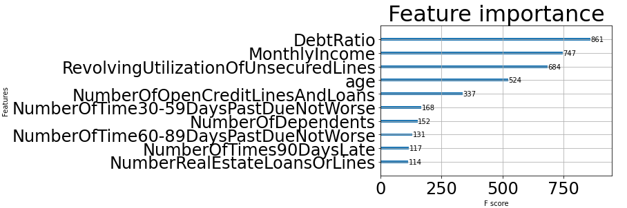

# README

## Questions

### Tell us how you validate your model, which, and why you chose such evaluation technique(s).
- Tried following cross validation techniques:
    - Kfold. Navigate to: `experiment/01/notebooks/02-LeonardYeo-Model-KFold.ipynb`
    - LOOCV (didnt even run due to highly computation resource intensive). Navigate to: `experiment/01/notebooks/02-LeonardYeo-Model-LOOCV.ipynb`
    - StratifiedKFold. Navigate to: `experiment/01/notebooks/02-LeonardYeo-Model-StratifiedKFold.ipynb`

### What is AUC? Why do you think AUC was used as the evaluation metric for such a problem? What are other metrics that you think would also be suitable for this competition?
- AUC measures the entire two-dimensional area underneath the entire ROC curve. 
- AUC provides an aggregate measure of performance across all possible classification thresholds.
- Other metrics to be considered are: Logloss, F1, Accuracy, Confusion Matrix. They are documented in the following notebooks:
    - `experiment/01/notebooks/02-LeonardYeo-Model-KFold.ipynb`
    - `experiment/01/notebooks/02-LeonardYeo-Model-StratifiedKFold.ipynb`
    - `experiment/01/notebooks/02-LeonardYeo-Model-Train-Test-Split.ipynb`

### What insight(s) do you have from your model? What is your preliminary analysis of the given dataset?

#### EDA
- Analysis of the dataset can be found in: `experiment/01/notebooks/01-LeonardYeo-Preprocessing-EDA.ipynb`
- The target is imbalanced which means a lot more 0s than 1s.
    - 
- There is also NaN values in `MonthlyIncome` and `NumberOfDependents`.
    - 
- There are also possible outliers in `MonthlyIncome`.
    - 
- None of the features are normal distribution after checking against Sharpiro.
    - 

#### Feature Scaling
- MinMax Scaling as feature are not normal distribution.

#### Feature Selection
Tested on XGBoost Classifier on default parameters.
- Backward Elimination
    - 'RevolvingUtilizationOfUnsecuredLines',
    - 'age',
    - 'NumberOfTime30-59DaysPastDueNotWorse',
    - 'MonthlyIncome',
    - 'NumberOfOpenCreditLinesAndLoans',
    - 'NumberOfTimes90DaysLate',
    - 'NumberOfTime60-89DaysPastDueNotWorse',
    - 'NumberOfDependents'
- Recursive Feature Elimination
    - 'RevolvingUtilizationOfUnsecuredLines',
    - 'NumberOfTime30-59DaysPastDueNotWorse',
    - 'DebtRatio',
    - 'NumberOfTimes90DaysLate',
    - 'NumberOfTime60-89DaysPastDueNotWorse'
- Feature Importance
    - 

#### Model
- Chose the features from XGBoost feature importance:
    - 'RevolvingUtilizationOfUnsecuredLines',
    - 'age',
    - 'DebtRatio',
    - 'MonthlyIncome',
    - 'NumberOfOpenCreditLinesAndLoans'
- Model seems to do well with train/validation set with ~78% AUC. However when test with test set on Kaggle, did not do as well as expected with a ~45% AUC. It could be a case of overfitting which can be minimized with early stopping, regualization and etc. Hyperparameter tuning can be performed to get best performing parameters for the model.

### Can you get into the top 100 of the private leaderboard, or even higher?
- Unfortunately, I did not get into the top 100 of the private leaderboard.