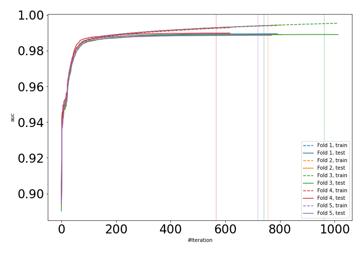
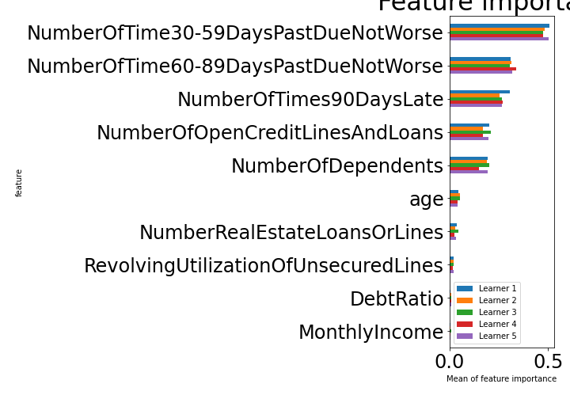

# Summary of 10_LightGBM

[<< Go back](../README.md)

## LightGBM
- **n_jobs**: -1
- **objective**: binary
- **metric**: auc
- **num_leaves**: 15
- **learning_rate**: 0.1
- **feature_fraction**: 0.8
- **bagging_fraction**: 0.9
- **min_data_in_leaf**: 50
- **explain_level**: 1

## Validation
 - **validation_type**: kfold
 - **k_folds**: 5
 - **shuffle**: True
 - **stratify**: True

## Optimized metric
auc

## Training time

174.7 seconds

## Metric details
|           |    score |     threshold |
|:----------|---------:|--------------:|
| logloss   | 0.10816  | nan           |
| auc       | 0.989137 | nan           |
| f1        | 0.960827 |   0.417748    |
| accuracy  | 0.961553 |   0.417748    |
| precision | 1        |   0.999847    |
| recall    | 1        |   0.000188094 |
| mcc       | 0.92374  |   0.417748    |

## Confusion matrix (at threshold=0.417748)
|                     |   Predicted as negative |   Predicted as positive |
|:--------------------|------------------------:|------------------------:|
| Labeled as negative |                   78820 |                    1602 |
| Labeled as positive |                    4582 |                   75840 |

## Learning curves

## Permutation-based Importance

[<< Go back](../README.md)
