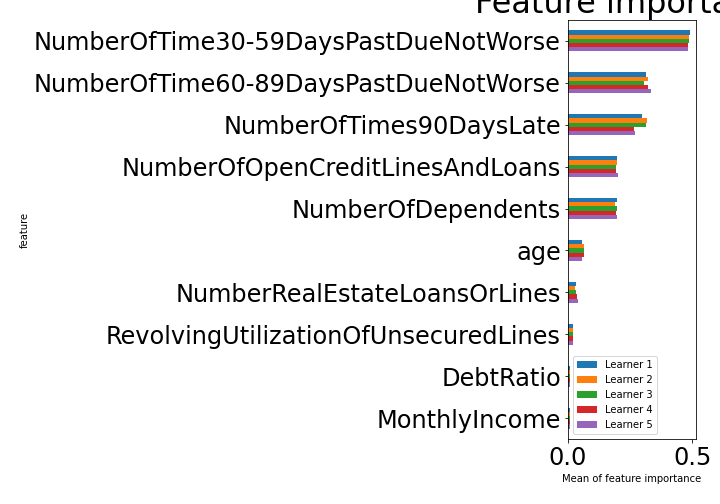

# Summary of 11_LightGBM

[<< Go back](../README.md)

## LightGBM
- **n_jobs**: -1
- **objective**: binary
- **metric**: binary_logloss
- **num_leaves**: 15
- **learning_rate**: 0.1
- **feature_fraction**: 0.9
- **bagging_fraction**: 0.5
- **min_data_in_leaf**: 50
- **explain_level**: 1

## Validation
 - **validation_type**: kfold
 - **k_folds**: 5
 - **shuffle**: True
 - **stratify**: True

## Optimized metric
auc

## Training time

204.0 seconds

## Metric details
|           |    score |     threshold |
|:----------|---------:|--------------:|
| logloss   | 0.106367 | nan           |
| auc       | 0.98905  | nan           |
| f1        | 0.961282 |   0.577193    |
| accuracy  | 0.962417 |   0.577193    |
| precision | 1        |   0.999933    |
| recall    | 1        |   3.20077e-05 |
| mcc       | 0.926429 |   0.577193    |

## Confusion matrix (at threshold=0.577193)
|                     |   Predicted as negative |   Predicted as positive |
|:--------------------|------------------------:|------------------------:|
| Labeled as negative |                   79758 |                     664 |
| Labeled as positive |                    5381 |                   75041 |

## Learning curves

## Permutation-based Importance

[<< Go back](../README.md)
