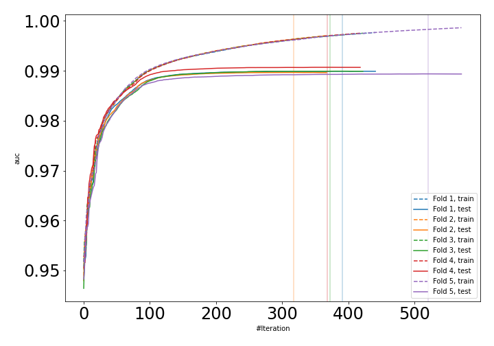
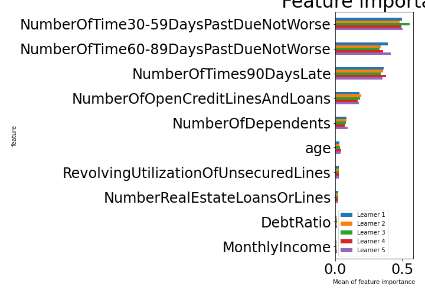

# Summary of 12_LightGBM

[<< Go back](../README.md)

## LightGBM
- **n_jobs**: -1
- **objective**: binary
- **metric**: auc
- **num_leaves**: 95
- **learning_rate**: 0.05
- **feature_fraction**: 1.0
- **bagging_fraction**: 0.5
- **min_data_in_leaf**: 30
- **explain_level**: 1

## Validation
 - **validation_type**: kfold
 - **k_folds**: 5
 - **shuffle**: True
 - **stratify**: True

## Optimized metric
auc

## Training time

268.3 seconds

## Metric details
|           |    score |     threshold |
|:----------|---------:|--------------:|
| logloss   | 0.105782 | nan           |
| auc       | 0.989888 | nan           |
| f1        | 0.960765 |   0.598151    |
| accuracy  | 0.961951 |   0.598151    |
| precision | 1        |   0.999416    |
| recall    | 1        |   0.000191684 |
| mcc       | 0.925593 |   0.598151    |

## Confusion matrix (at threshold=0.598151)
|                     |   Predicted as negative |   Predicted as positive |
|:--------------------|------------------------:|------------------------:|
| Labeled as negative |                   79792 |                     630 |
| Labeled as positive |                    5490 |                   74932 |

## Learning curves

## Permutation-based Importance

[<< Go back](../README.md)
