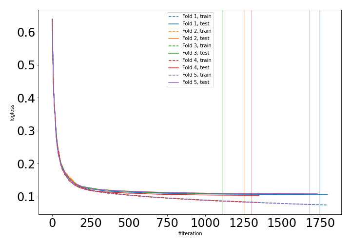
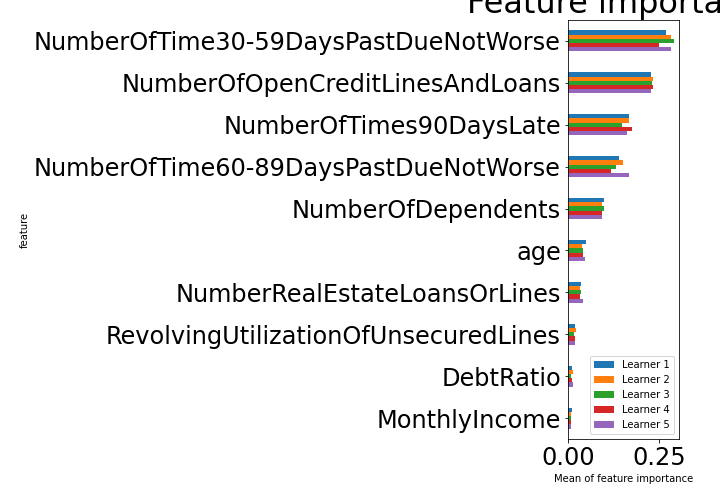

# Summary of 15_CatBoost

[<< Go back](../README.md)

## CatBoost
- **n_jobs**: -1
- **learning_rate**: 0.1
- **depth**: 6
- **rsm**: 0.7
- **loss_function**: Logloss
- **explain_level**: 1

## Validation
 - **validation_type**: kfold
 - **k_folds**: 5
 - **shuffle**: True
 - **stratify**: True

## Optimized metric
auc

## Training time

141.4 seconds

## Metric details
|           |    score |     threshold |
|:----------|---------:|--------------:|
| logloss   | 0.107263 | nan           |
| auc       | 0.98907  | nan           |
| f1        | 0.960861 |   0.593886    |
| accuracy  | 0.962025 |   0.593886    |
| precision | 1        |   0.999419    |
| recall    | 1        |   2.14217e-05 |
| mcc       | 0.92569  |   0.593886    |

## Confusion matrix (at threshold=0.593886)
|                     |   Predicted as negative |   Predicted as positive |
|:--------------------|------------------------:|------------------------:|
| Labeled as negative |                   79760 |                     662 |
| Labeled as positive |                    5446 |                   74976 |

## Learning curves

## Permutation-based Importance

[<< Go back](../README.md)
