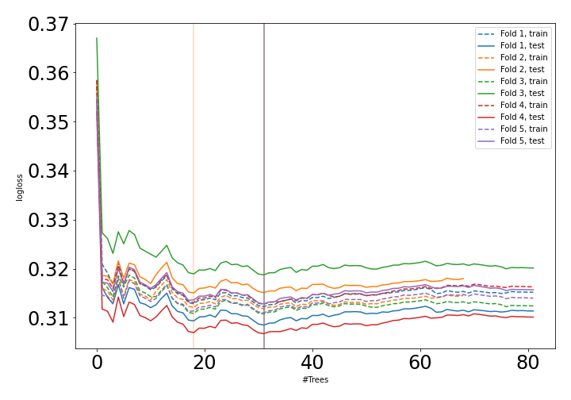
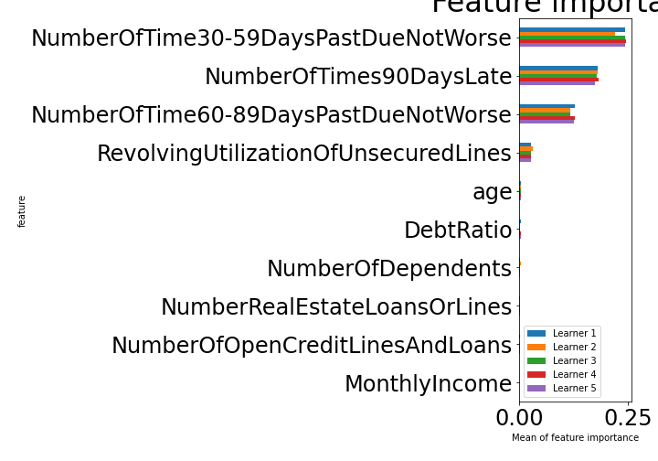

# Summary of 18_RandomForest

[<< Go back](../README.md)

## Random Forest
- **n_jobs**: -1
- **criterion**: entropy
- **max_features**: 0.5
- **min_samples_split**: 20
- **max_depth**: 5
- **explain_level**: 1

## Validation
 - **validation_type**: kfold
 - **k_folds**: 5
 - **shuffle**: True
 - **stratify**: True

## Optimized metric
auc

## Training time

58.0 seconds

## Metric details
|           |    score |   threshold |
|:----------|---------:|------------:|
| logloss   | 0.312381 | nan         |
| auc       | 0.937405 | nan         |
| f1        | 0.869892 |   0.571892  |
| accuracy  | 0.878758 |   0.571892  |
| precision | 1        |   0.943065  |
| recall    | 1        |   0.0601068 |
| mcc       | 0.765333 |   0.597568  |

## Confusion matrix (at threshold=0.571892)
|                     |   Predicted as negative |   Predicted as positive |
|:--------------------|------------------------:|------------------------:|
| Labeled as negative |                   76152 |                    4270 |
| Labeled as positive |                   15231 |                   65191 |

## Learning curves

## Permutation-based Importance

[<< Go back](../README.md)
