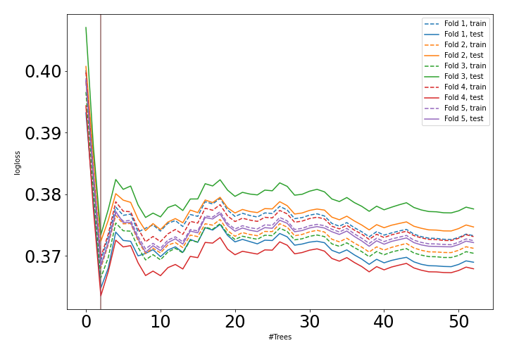
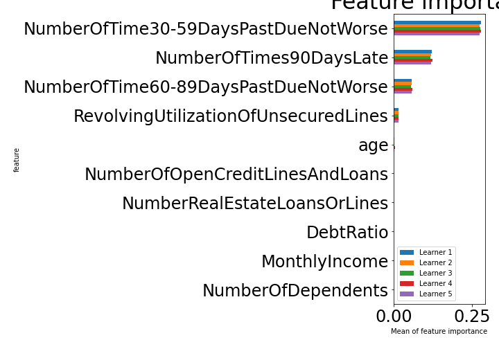

# Summary of 19_RandomForest

[<< Go back](../README.md)

## Random Forest
- **n_jobs**: -1
- **criterion**: gini
- **max_features**: 0.5
- **min_samples_split**: 30
- **max_depth**: 3
- **explain_level**: 1

## Validation
 - **validation_type**: kfold
 - **k_folds**: 5
 - **shuffle**: True
 - **stratify**: True

## Optimized metric
auc

## Training time

44.9 seconds

## Metric details
|           |    score |   threshold |
|:----------|---------:|------------:|
| logloss   | 0.368524 |  nan        |
| auc       | 0.917152 |  nan        |
| f1        | 0.857017 |    0.559713 |
| accuracy  | 0.865248 |    0.559713 |
| precision | 1        |    0.925594 |
| recall    | 1        |    0.119718 |
| mcc       | 0.735388 |    0.559713 |

## Confusion matrix (at threshold=0.559713)
|                     |   Predicted as negative |   Predicted as positive |
|:--------------------|------------------------:|------------------------:|
| Labeled as negative |                   74215 |                    6207 |
| Labeled as positive |                   15467 |                   64955 |

## Learning curves

## Permutation-based Importance

[<< Go back](../README.md)
