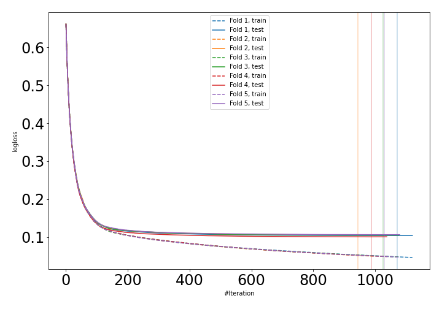
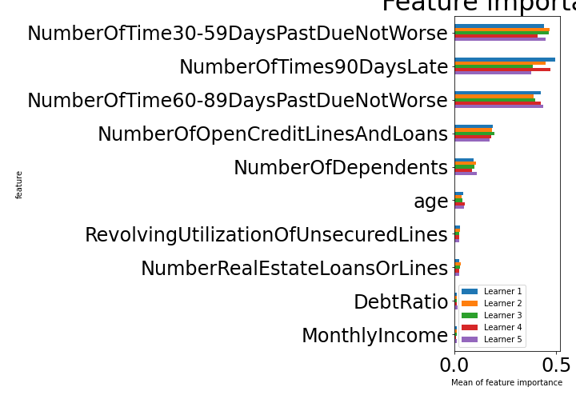

# Summary of 1_Default_LightGBM

[<< Go back](../README.md)

## LightGBM
- **n_jobs**: -1
- **objective**: binary
- **metric**: binary_logloss
- **num_leaves**: 63
- **learning_rate**: 0.05
- **feature_fraction**: 0.9
- **bagging_fraction**: 0.9
- **min_data_in_leaf**: 10
- **explain_level**: 1

## Validation
 - **validation_type**: kfold
 - **k_folds**: 5
 - **shuffle**: True
 - **stratify**: True

## Optimized metric
auc

## Training time

400.5 seconds

## Metric details
|           |    score |     threshold |
|:----------|---------:|--------------:|
| logloss   | 0.104332 | nan           |
| auc       | 0.989564 | nan           |
| f1        | 0.963077 |   0.539737    |
| accuracy  | 0.964009 |   0.539737    |
| precision | 1        |   0.999924    |
| recall    | 1        |   2.76263e-05 |
| mcc       | 0.9292   |   0.539737    |

## Confusion matrix (at threshold=0.539737)
|                     |   Predicted as negative |   Predicted as positive |
|:--------------------|------------------------:|------------------------:|
| Labeled as negative |                   79556 |                     866 |
| Labeled as positive |                    4923 |                   75499 |

## Learning curves

## Permutation-based Importance

[<< Go back](../README.md)
