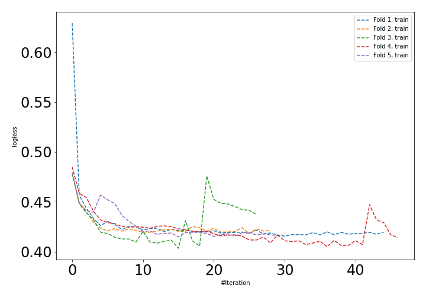
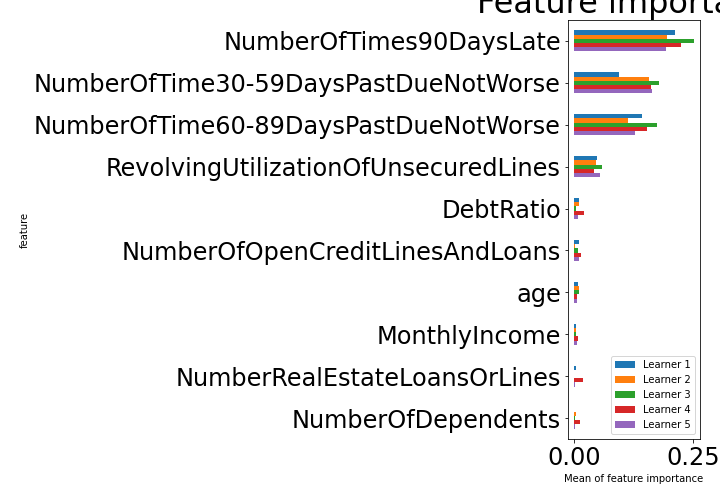

# Summary of 22_NeuralNetwork

[<< Go back](../README.md)

## Neural Network
- **n_jobs**: -1
- **dense_1_size**: 32
- **dense_2_size**: 4
- **learning_rate**: 0.05
- **explain_level**: 1

## Validation
 - **validation_type**: kfold
 - **k_folds**: 5
 - **shuffle**: True
 - **stratify**: True

## Optimized metric
auc

## Training time

71.2 seconds

## Metric details
|           |    score |     threshold |
|:----------|---------:|--------------:|
| logloss   | 0.397742 | nan           |
| auc       | 0.899748 | nan           |
| f1        | 0.837598 |   0.451598    |
| accuracy  | 0.837905 |   0.525344    |
| precision | 0.94325  |   0.947424    |
| recall    | 1        |   1.76999e-08 |
| mcc       | 0.676069 |   0.525344    |

## Confusion matrix (at threshold=0.525344)
|                     |   Predicted as negative |   Predicted as positive |
|:--------------------|------------------------:|------------------------:|
| Labeled as negative |                   68499 |                   11923 |
| Labeled as positive |                   14149 |                   66273 |

## Learning curves

## Permutation-based Importance

[<< Go back](../README.md)
