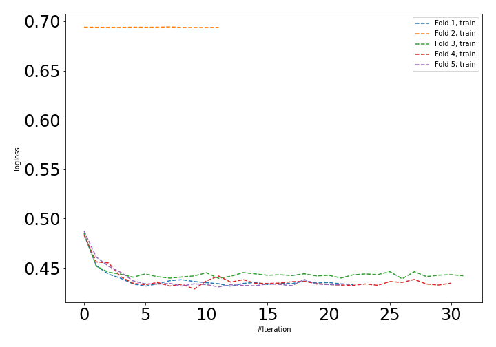
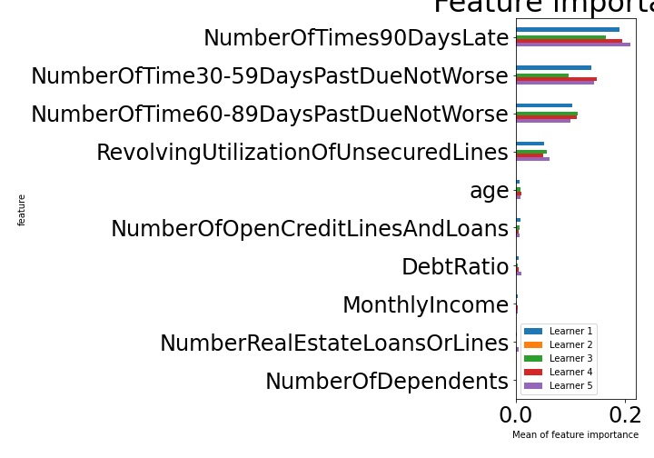

# Summary of 23_NeuralNetwork

[<< Go back](../README.md)

## Neural Network
- **n_jobs**: -1
- **dense_1_size**: 16
- **dense_2_size**: 4
- **learning_rate**: 0.1
- **explain_level**: 1

## Validation
 - **validation_type**: kfold
 - **k_folds**: 5
 - **shuffle**: True
 - **stratify**: True

## Optimized metric
auc

## Training time

54.2 seconds

## Metric details
|           |    score |   threshold |
|:----------|---------:|------------:|
| logloss   | 0.473385 | nan         |
| auc       | 0.852542 | nan         |
| f1        | 0.784828 |   0.390864  |
| accuracy  | 0.758679 |   0.484685  |
| precision | 0.91924  |   0.894134  |
| recall    | 1        |   0.0077988 |
| mcc       | 0.531416 |   0.440567  |

## Confusion matrix (at threshold=0.484685)
|                     |   Predicted as negative |   Predicted as positive |
|:--------------------|------------------------:|------------------------:|
| Labeled as negative |                   52810 |                   27612 |
| Labeled as positive |                   11203 |                   69219 |

## Learning curves

## Permutation-based Importance

[<< Go back](../README.md)
