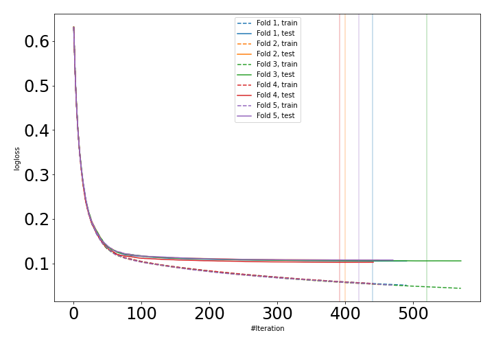
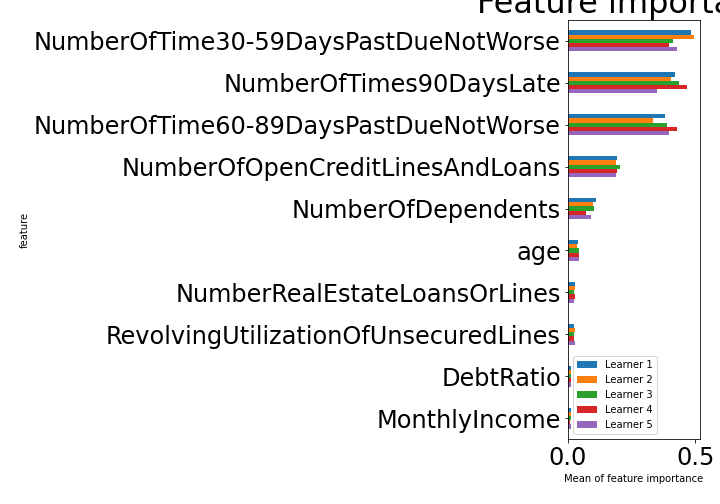

# Summary of 25_LightGBM

[<< Go back](../README.md)

## LightGBM
- **n_jobs**: -1
- **objective**: binary
- **metric**: binary_logloss
- **num_leaves**: 63
- **learning_rate**: 0.1
- **feature_fraction**: 0.9
- **bagging_fraction**: 0.9
- **min_data_in_leaf**: 10
- **explain_level**: 1

## Validation
 - **validation_type**: kfold
 - **k_folds**: 5
 - **shuffle**: True
 - **stratify**: True

## Optimized metric
auc

## Training time

206.7 seconds

## Metric details
|           |    score |     threshold |
|:----------|---------:|--------------:|
| logloss   | 0.105687 | nan           |
| auc       | 0.989388 | nan           |
| f1        | 0.962333 |   0.517645    |
| accuracy  | 0.963219 |   0.517645    |
| precision | 1        |   0.999919    |
| recall    | 1        |   5.23331e-05 |
| mcc       | 0.927464 |   0.517645    |

## Confusion matrix (at threshold=0.517645)
|                     |   Predicted as negative |   Predicted as positive |
|:--------------------|------------------------:|------------------------:|
| Labeled as negative |                   79355 |                    1067 |
| Labeled as positive |                    4849 |                   75573 |

## Learning curves

## Permutation-based Importance

[<< Go back](../README.md)
