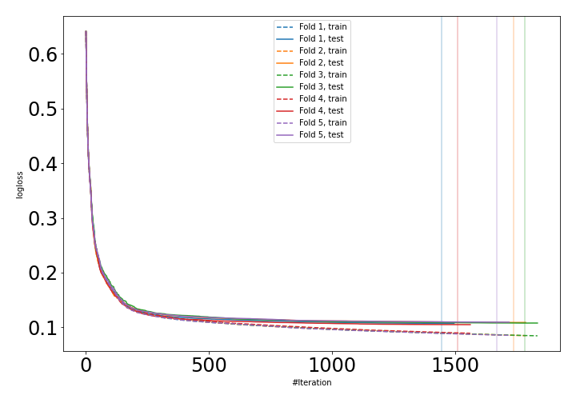

# Summary of 26_CatBoost

[<< Go back](../README.md)

## CatBoost
- **n_jobs**: -1
- **learning_rate**: 0.1
- **depth**: 5
- **rsm**: 0.7
- **loss_function**: Logloss
- **explain_level**: 1

## Validation
 - **validation_type**: kfold
 - **k_folds**: 5
 - **shuffle**: True
 - **stratify**: True

## Optimized metric
auc

## Training time

144.6 seconds

## Metric details
|           |    score |     threshold |
|:----------|---------:|--------------:|
| logloss   | 0.107541 | nan           |
| auc       | 0.989055 | nan           |
| f1        | 0.96016  |   0.616654    |
| accuracy  | 0.961422 |   0.616654    |
| precision | 1        |   0.999795    |
| recall    | 1        |   6.57716e-05 |
| mcc       | 0.924702 |   0.616654    |

## Confusion matrix (at threshold=0.616654)
|                     |   Predicted as negative |   Predicted as positive |
|:--------------------|------------------------:|------------------------:|
| Labeled as negative |                   79867 |                     555 |
| Labeled as positive |                    5650 |                   74772 |

## Learning curves

## Permutation-based Importance

[<< Go back](../README.md)
