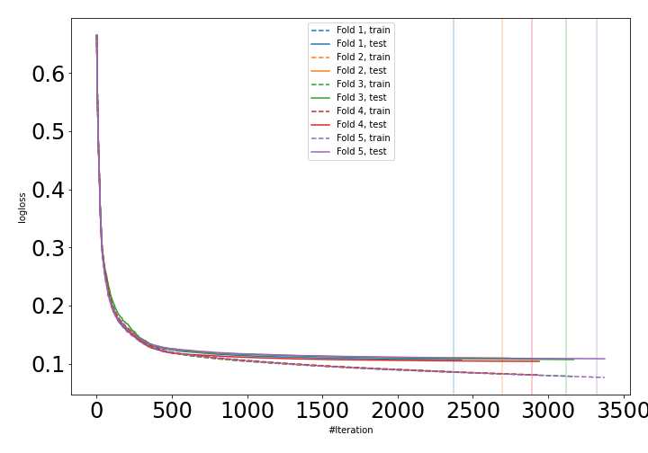
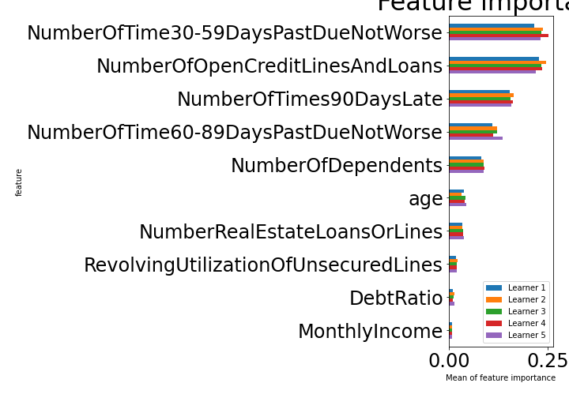

# Summary of 28_CatBoost

[<< Go back](../README.md)

## CatBoost
- **n_jobs**: -1
- **learning_rate**: 0.05
- **depth**: 6
- **rsm**: 0.7
- **loss_function**: Logloss
- **explain_level**: 1

## Validation
 - **validation_type**: kfold
 - **k_folds**: 5
 - **shuffle**: True
 - **stratify**: True

## Optimized metric
auc

## Training time

257.6 seconds

## Metric details
|           |    score |     threshold |
|:----------|---------:|--------------:|
| logloss   | 0.107242 | nan           |
| auc       | 0.98917  | nan           |
| f1        | 0.960693 |   0.62687     |
| accuracy  | 0.961926 |   0.62687     |
| precision | 1        |   0.999528    |
| recall    | 1        |   4.75102e-05 |
| mcc       | 0.925674 |   0.62687     |

## Confusion matrix (at threshold=0.62687)
|                     |   Predicted as negative |   Predicted as positive |
|:--------------------|------------------------:|------------------------:|
| Labeled as negative |                   79882 |                     540 |
| Labeled as positive |                    5584 |                   74838 |

## Learning curves

## Permutation-based Importance

[<< Go back](../README.md)
