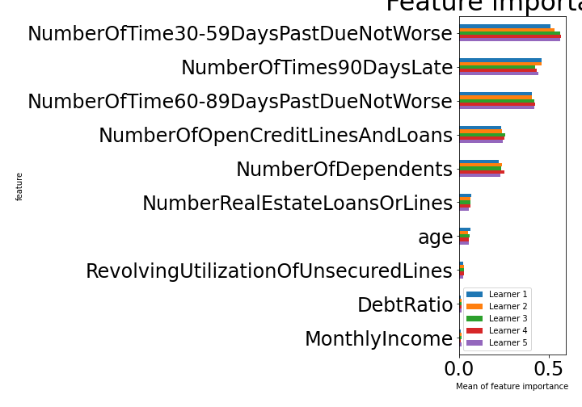

# Summary of 2_Default_Xgboost

[<< Go back](../README.md)

## Extreme Gradient Boosting (Xgboost)
- **n_jobs**: -1
- **objective**: binary:logistic
- **eval_metric**: logloss
- **eta**: 0.075
- **max_depth**: 6
- **min_child_weight**: 1
- **subsample**: 1.0
- **colsample_bytree**: 1.0
- **explain_level**: 1

## Validation
 - **validation_type**: kfold
 - **k_folds**: 5
 - **shuffle**: True
 - **stratify**: True

## Optimized metric
auc

## Training time

126.3 seconds

## Metric details
|           |    score |     threshold |
|:----------|---------:|--------------:|
| logloss   | 0.110969 | nan           |
| auc       | 0.988365 | nan           |
| f1        | 0.959125 |   0.532189    |
| accuracy  | 0.960204 |   0.532189    |
| precision | 1        |   0.999988    |
| recall    | 1        |   2.55968e-05 |
| mcc       | 0.921692 |   0.532189    |

## Confusion matrix (at threshold=0.532189)
|                     |   Predicted as negative |   Predicted as positive |
|:--------------------|------------------------:|------------------------:|
| Labeled as negative |                   79344 |                    1078 |
| Labeled as positive |                    5323 |                   75099 |

## Learning curves

## Permutation-based Importance

[<< Go back](../README.md)
