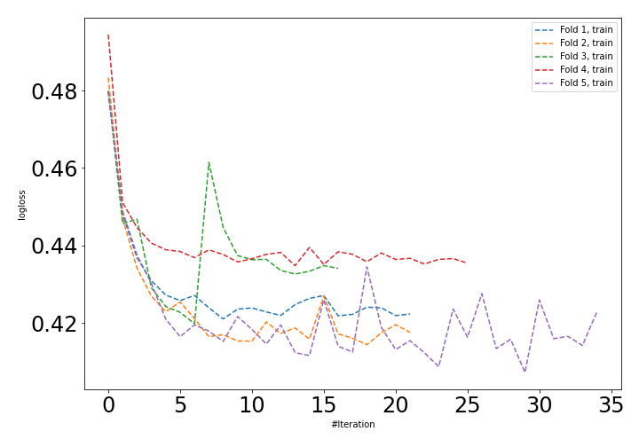
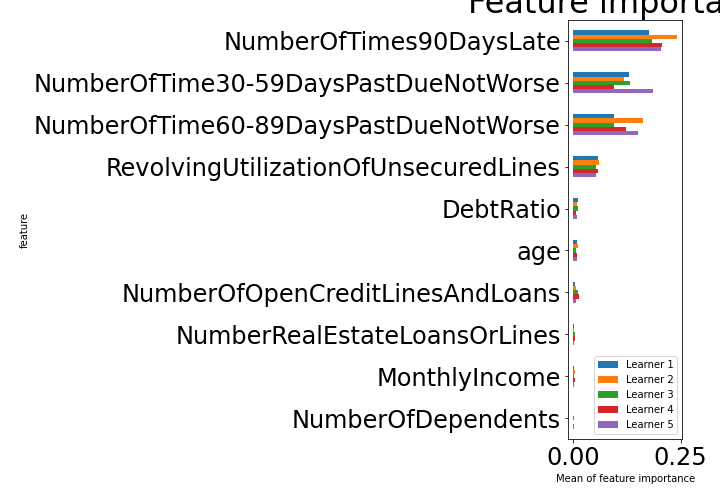

# Summary of 4_Default_NeuralNetwork

[<< Go back](../README.md)

## Neural Network
- **n_jobs**: -1
- **dense_1_size**: 32
- **dense_2_size**: 16
- **learning_rate**: 0.05
- **explain_level**: 1

## Validation
 - **validation_type**: kfold
 - **k_folds**: 5
 - **shuffle**: True
 - **stratify**: True

## Optimized metric
auc

## Training time

62.7 seconds

## Metric details
|           |    score |    threshold |
|:----------|---------:|-------------:|
| logloss   | 0.406764 | nan          |
| auc       | 0.895085 | nan          |
| f1        | 0.831586 |   0.439182   |
| accuracy  | 0.830743 |   0.494333   |
| precision | 0.957255 |   0.968767   |
| recall    | 1        |   0.00271858 |
| mcc       | 0.661744 |   0.518696   |

## Confusion matrix (at threshold=0.494333)
|                     |   Predicted as negative |   Predicted as positive |
|:--------------------|------------------------:|------------------------:|
| Labeled as negative |                   67352 |                   13070 |
| Labeled as positive |                   14154 |                   66268 |

## Learning curves

## Permutation-based Importance

[<< Go back](../README.md)
