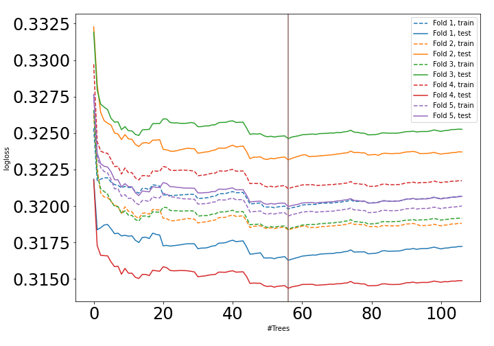
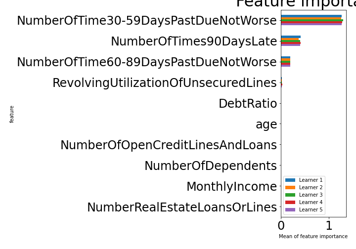

# Summary of 5_Default_RandomForest

[<< Go back](../README.md)

## Random Forest
- **n_jobs**: -1
- **criterion**: gini
- **max_features**: 0.9
- **min_samples_split**: 30
- **max_depth**: 4
- **explain_level**: 1

## Validation
 - **validation_type**: kfold
 - **k_folds**: 5
 - **shuffle**: True
 - **stratify**: True

## Optimized metric
auc

## Training time

78.4 seconds

## Metric details
|           |    score |   threshold |
|:----------|---------:|------------:|
| logloss   | 0.319676 |  nan        |
| auc       | 0.927282 |  nan        |
| f1        | 0.861203 |    0.523285 |
| accuracy  | 0.87067  |    0.523285 |
| precision | 1        |    0.937105 |
| recall    | 1        |    0.084964 |
| mcc       | 0.748686 |    0.547347 |

## Confusion matrix (at threshold=0.523285)
|                     |   Predicted as negative |   Predicted as positive |
|:--------------------|------------------------:|------------------------:|
| Labeled as negative |                   75506 |                    4916 |
| Labeled as positive |                   15886 |                   64536 |

## Learning curves

## Permutation-based Importance

[<< Go back](../README.md)
