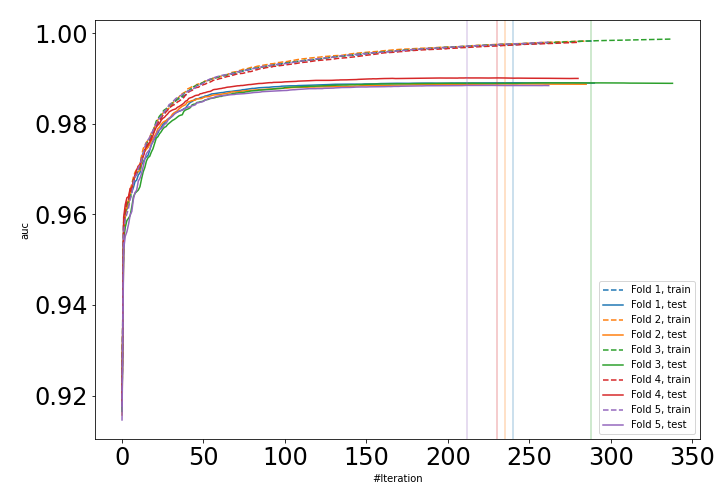
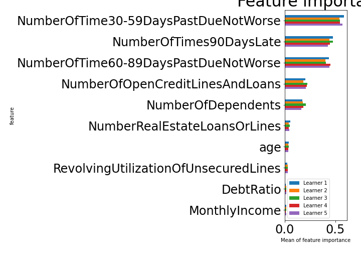

# Summary of 6_Xgboost

[<< Go back](../README.md)

## Extreme Gradient Boosting (Xgboost)
- **n_jobs**: -1
- **objective**: binary:logistic
- **eval_metric**: auc
- **eta**: 0.15
- **max_depth**: 8
- **min_child_weight**: 1
- **subsample**: 1.0
- **colsample_bytree**: 0.9
- **explain_level**: 1

## Validation
 - **validation_type**: kfold
 - **k_folds**: 5
 - **shuffle**: True
 - **stratify**: True

## Optimized metric
auc

## Training time

113.6 seconds

## Metric details
|           |    score |     threshold |
|:----------|---------:|--------------:|
| logloss   | 0.109921 | nan           |
| auc       | 0.989066 | nan           |
| f1        | 0.958836 |   0.547197    |
| accuracy  | 0.959955 |   0.547197    |
| precision | 1        |   0.999918    |
| recall    | 1        |   5.06897e-05 |
| mcc       | 0.921272 |   0.547197    |

## Confusion matrix (at threshold=0.547197)
|                     |   Predicted as negative |   Predicted as positive |
|:--------------------|------------------------:|------------------------:|
| Labeled as negative |                   79387 |                    1035 |
| Labeled as positive |                    5406 |                   75016 |

## Learning curves

## Permutation-based Importance

[<< Go back](../README.md)
