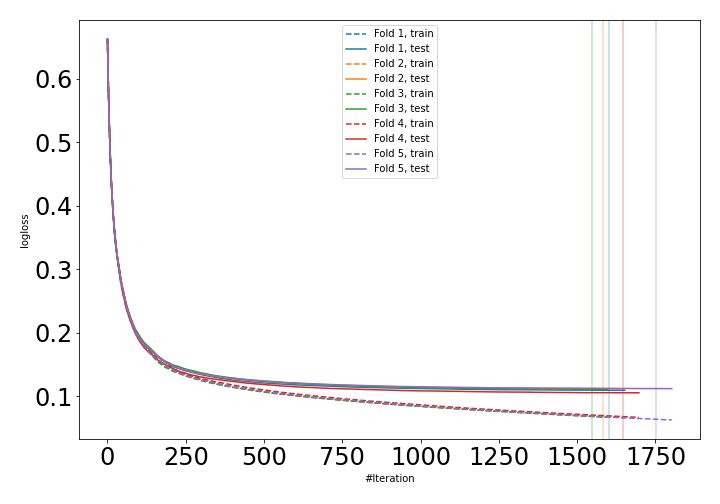
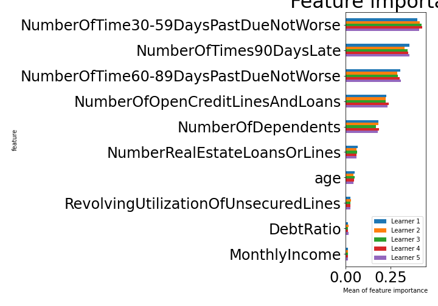

# Summary of 7_Xgboost

[<< Go back](../README.md)

## Extreme Gradient Boosting (Xgboost)
- **n_jobs**: -1
- **objective**: binary:logistic
- **eval_metric**: logloss
- **eta**: 0.05
- **max_depth**: 6
- **min_child_weight**: 1
- **subsample**: 0.6
- **colsample_bytree**: 1.0
- **explain_level**: 1

## Validation
 - **validation_type**: kfold
 - **k_folds**: 5
 - **shuffle**: True
 - **stratify**: True

## Optimized metric
auc

## Training time

179.6 seconds

## Metric details
|           |    score |     threshold |
|:----------|---------:|--------------:|
| logloss   | 0.110022 | nan           |
| auc       | 0.9887   | nan           |
| f1        | 0.959331 |   0.526077    |
| accuracy  | 0.960372 |   0.526077    |
| precision | 1        |   0.999949    |
| recall    | 1        |   4.35222e-05 |
| mcc       | 0.921951 |   0.526077    |

## Confusion matrix (at threshold=0.526077)
|                     |   Predicted as negative |   Predicted as positive |
|:--------------------|------------------------:|------------------------:|
| Labeled as negative |                   79293 |                    1129 |
| Labeled as positive |                    5245 |                   75177 |

## Learning curves

## Permutation-based Importance

[<< Go back](../README.md)
