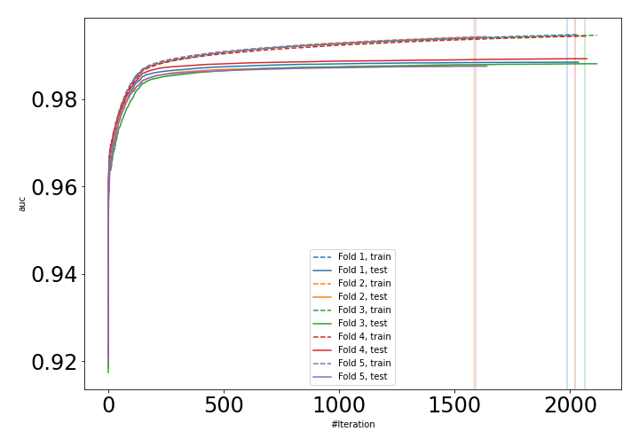
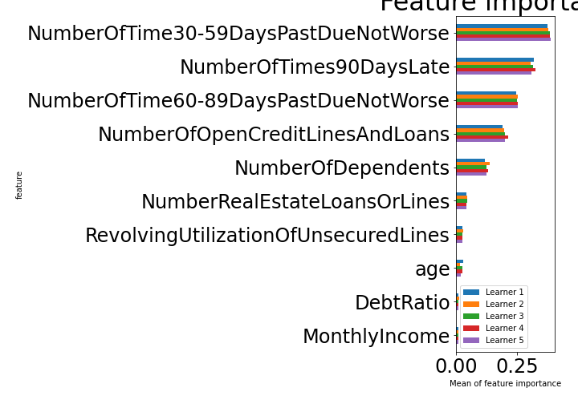

# Summary of 8_Xgboost

[<< Go back](../README.md)

## Extreme Gradient Boosting (Xgboost)
- **n_jobs**: -1
- **objective**: binary:logistic
- **eval_metric**: auc
- **eta**: 0.05
- **max_depth**: 9
- **min_child_weight**: 50
- **subsample**: 1.0
- **colsample_bytree**: 0.8
- **explain_level**: 1

## Validation
 - **validation_type**: kfold
 - **k_folds**: 5
 - **shuffle**: True
 - **stratify**: True

## Optimized metric
auc

## Training time

521.6 seconds

## Metric details
|           |    score |     threshold |
|:----------|---------:|--------------:|
| logloss   | 0.116129 | nan           |
| auc       | 0.988164 | nan           |
| f1        | 0.95645  |   0.519945    |
| accuracy  | 0.957574 |   0.519945    |
| precision | 1        |   0.99949     |
| recall    | 1        |   0.000123796 |
| mcc       | 0.916368 |   0.519945    |

## Confusion matrix (at threshold=0.519945)
|                     |   Predicted as negative |   Predicted as positive |
|:--------------------|------------------------:|------------------------:|
| Labeled as negative |                   79085 |                    1337 |
| Labeled as positive |                    5487 |                   74935 |

## Learning curves

## Permutation-based Importance

[<< Go back](../README.md)
