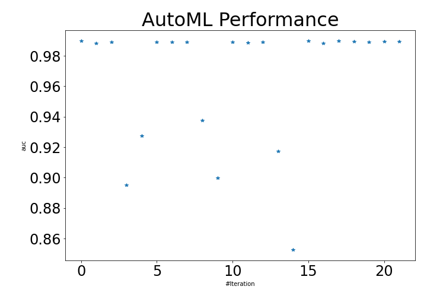
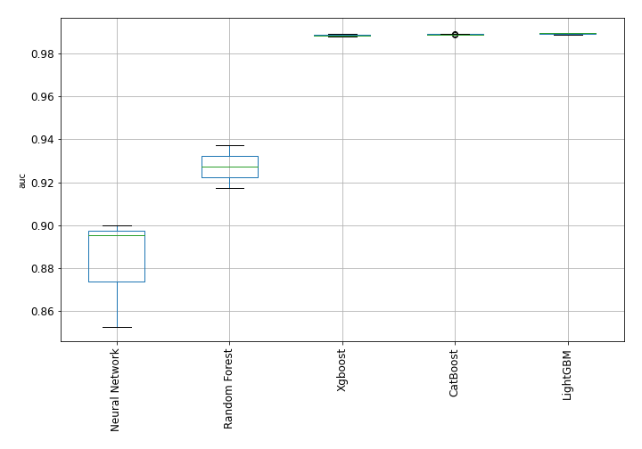

# AutoML Leaderboard

| Best model   | name                                                         | model_type     | metric_type   |   metric_value |   train_time |   single_prediction_time |
|:-------------|:-------------------------------------------------------------|:---------------|:--------------|---------------:|-------------:|-------------------------:|
|              | [1_Default_LightGBM](1_Default_LightGBM/README.md)           | LightGBM       | auc           |       0.989564 |       401.16 |                   0.0227 |
|              | [2_Default_Xgboost](2_Default_Xgboost/README.md)             | Xgboost        | auc           |       0.988365 |       126.8  |                   0.0257 |
|              | [3_Default_CatBoost](3_Default_CatBoost/README.md)           | CatBoost       | auc           |       0.98904  |       165.64 |                   0.024  |
|              | [4_Default_NeuralNetwork](4_Default_NeuralNetwork/README.md) | Neural Network | auc           |       0.895085 |        63.28 |                   0.0223 |
|              | [5_Default_RandomForest](5_Default_RandomForest/README.md)   | Random Forest  | auc           |       0.927282 |        79.04 |                   0.0928 |
|              | [10_LightGBM](10_LightGBM/README.md)                         | LightGBM       | auc           |       0.989137 |       175.32 |                   0.0247 |
|              | [6_Xgboost](6_Xgboost/README.md)                             | Xgboost        | auc           |       0.989066 |       114.14 |                   0.0223 |
|              | [14_CatBoost](14_CatBoost/README.md)                         | CatBoost       | auc           |       0.988773 |        92.19 |                   0.0239 |
|              | [18_RandomForest](18_RandomForest/README.md)                 | Random Forest  | auc           |       0.937405 |        58.62 |                   0.0751 |
|              | [22_NeuralNetwork](22_NeuralNetwork/README.md)               | Neural Network | auc           |       0.899748 |        71.76 |                   0.0208 |
|              | [11_LightGBM](11_LightGBM/README.md)                         | LightGBM       | auc           |       0.98905  |       204.56 |                   0.0228 |
|              | [7_Xgboost](7_Xgboost/README.md)                             | Xgboost        | auc           |       0.9887   |       180.18 |                   0.0233 |
|              | [15_CatBoost](15_CatBoost/README.md)                         | CatBoost       | auc           |       0.98907  |       142.04 |                   0.0236 |
|              | [19_RandomForest](19_RandomForest/README.md)                 | Random Forest  | auc           |       0.917152 |        45.42 |                   0.0491 |
|              | [23_NeuralNetwork](23_NeuralNetwork/README.md)               | Neural Network | auc           |       0.852542 |        54.75 |                   0.0208 |
| **the best** | [12_LightGBM](12_LightGBM/README.md)                         | LightGBM       | auc           |       0.989888 |       268.82 |                   0.0236 |
|              | [8_Xgboost](8_Xgboost/README.md)                             | Xgboost        | auc           |       0.988164 |       522.17 |                   0.0274 |
|              | [24_LightGBM](24_LightGBM/README.md)                         | LightGBM       | auc           |       0.98983  |       146.73 |                   0.0215 |
|              | [25_LightGBM](25_LightGBM/README.md)                         | LightGBM       | auc           |       0.989388 |       207.25 |                   0.0226 |
|              | [26_CatBoost](26_CatBoost/README.md)                         | CatBoost       | auc           |       0.989055 |       145.17 |                   0.0229 |
|              | [27_LightGBM](27_LightGBM/README.md)                         | LightGBM       | auc           |       0.9895   |        94.1  |                   0.0209 |
|              | [28_CatBoost](28_CatBoost/README.md)                         | CatBoost       | auc           |       0.98917  |       258.2  |                   0.0247 |

### AutoML Performance

### AutoML Performance Boxplot
